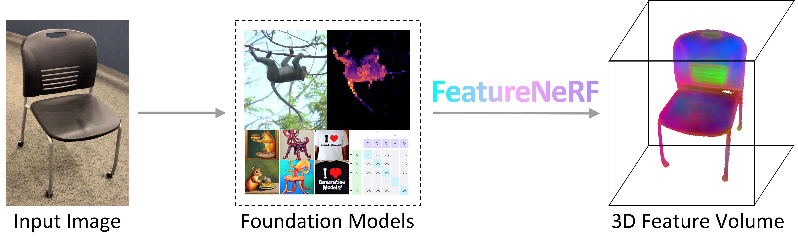

# FeatureNeRF

This repository is the official implementation of the paper:

> FeatureNeRF: Learning Generalizable NeRFs by Distilling Foundation Models  
> [_Jianglong Ye_](https://jianglongye.com/), [_Naiyan Wang_](https://winsty.net/), [_Xiaolong Wang_](https://xiaolonw.github.io/)  
> ICCV, 2023

[Project Page](https://jianglongye.com/featurenerf/) / [ArXiv](https://arxiv.org/abs/2303.12786) / [Video](https://www.youtube.com/watch?v=pAqNMvW6Gpo)

<div align="center">
  
</div>

## Environment Setup

(Our code has been tested with python 3.7, torch 1.12.1, CUDA 11.3 and RTX 3090)

To set up the environment, follow these steps:

```sh
conda create -n featnerf python=3.7 -y && conda activate featnerf
conda install pytorch==1.12.1 torchvision==0.13.1 torchaudio==0.12.1 cudatoolkit=11.3 -c pytorch -y
pip install "git+https://github.com/facebookresearch/pytorch3d.git@v0.7.2"
pip install tqdm tensorboard wandb opencv-python dotmap imageio omegaconf pyhocon==0.3.59 imgviz seaborn scikit-image
# pyhocon 0.3.60 does not work
```

Note that the dependencies listed above are recommended, latest versions may result in sub-optimal performance.

## Data Preparation

### Processed Data

We render 6 categories (Chair, Car, Airplane, Table, Bottle and Motorcycle) from [ShapeNet V1](https://shapenet.org/) dataset with [Blender](https://www.blender.org/) and collect annotations from [ShapeNet Part Dataset](https://cs.stanford.edu/~ericyi/project_page/part_annotation/), [PartNet](https://partnet.cs.stanford.edu/) and [KeypointNet](https://github.com/qq456cvb/KeypointNet).

Download our processed dataset from [OneDrive](https://ucsdcloud-my.sharepoint.com/:f:/g/personal/j7ye_ucsd_edu/EkXqAjjvyhhPoRQ7XdKSQwYBFKo9F0C2AaLMk23Pi3GCcA?e=jj75lS) or [Google Drive](https://drive.google.com/drive/folders/1cN0bZFCoo3UUdeiBPduqsZNGa_qoi3uu?usp=sharing) and extract it to the `data` directory. The directory structure should look like this:

```
PROJECT_ROOT
├── ...
└── data
    ├── ...
    ├── img
    │   ├── 02691156
    │   ├── 02958343
    │   └── ...
    ├── camera
    ├── kp_2d_anno
    ├── kp_3d_anno
    ├── part_2d_anno
    └── part_3d_anno
```

Since the data processing envolves filtering, alignment, and rendering of multiple datasets, cleaning this part of the code is overcomplex. Please contact the [author](mailto:jianglong.yeh@gmail.com) for any questions regarding the data processing.

### Generate Teacher Features

```sh
python process_data/generate_dino_feat.py  # takes around 10 hours for 6 categories on one RTX 3090
```

## Running

### Training

```sh
wandb login  # if you want to use wandb
python train/train.py -n feature_car_dino_256_0.25_share_coord_exp -c conf/exp/feature_dino_256_0.25_share_coord.conf --synset 02958343 --epochs 500
```

Change different `--synset` for different categories. If do not want to use wandb, set `--no_wandb` in the command line.

### Evaluation

We provide pre-trained models for evaluation. Download the pre-trained models from [OneDrive](https://ucsdcloud-my.sharepoint.com/:f:/g/personal/j7ye_ucsd_edu/Ej-sgbzqgQJOnx83TIhaD_0BM1CuDkbK0icJRFlJv8t3gA?e=2Y692Y) or [Google Drive](https://drive.google.com/drive/folders/1cs8bbwYqIJuZd-evLtlSSlASPKHfvh8z?usp=sharing) and extract them to the `outputs` directory. Run the following commands for evaluation:

```sh
python eval/eval_2d_task.py -n feature_car_dino_256_0.25_share_coord_exp -c conf/exp/feature_dino_256_0.25_share_coord.conf -F feature_dino_256_2d_part_kp_anno --synset 02958343 --save_vis
python eval/eval_nv_2d_task.py -n feature_car_dino_256_0.25_share_coord_exp -c conf/exp/feature_dino_256_0.25_share_coord.conf -F feature_dino_256_2d_part_kp_anno --synset 02958343 --save_vis
python eval/eval_3d_task.py -n feature_car_dino_256_0.25_share_coord_exp -c conf/exp/feature_dino_256_0.25_share_coord.conf -F feature_dino_256_3d_part_kp_anno --synset 02958343 --save_vis
```

Evaluation results will be saved in the `outputs` directory. Change different `--synset` for different categories. If do not want to save visualization, remove `--save_vis` in the command line.

## Citation

```bibtex
@article{ye2023featurenerf,
  title={FeatureNeRF: Learning Generalizable NeRFs by Distilling Foundation Models},
  author={Ye, Jianglong and Wang, Naiyan and Wang, Xiaolong},
  booktitle={Proceedings of the IEEE/CVF International Conference on Computer Vision},
  pages={8962--8973},
  year={2023}
}
```

## Acknowledgements

The code is heavily based on [pixel-nerf](https://github.com/sxyu/pixel-nerf), thanks for the great work!
